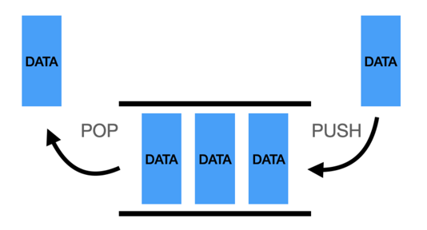

# Queue 큐

- 선입선출(First in, First Out) : 마지막에 데이터를 추가하고 가장 앞에 있는 것을 먼저 꺼냄
- 파이썬의 리스트가 스택과 같은 형태
- 관련함수
  - insert() : 원하는 위치에 데이터를 넣음
  - append() : 마지막에 데이터를 추가
  - pop() : 마지막 데이터를 꺼냄

### 참고자료
- https://wikidocs.net/198491